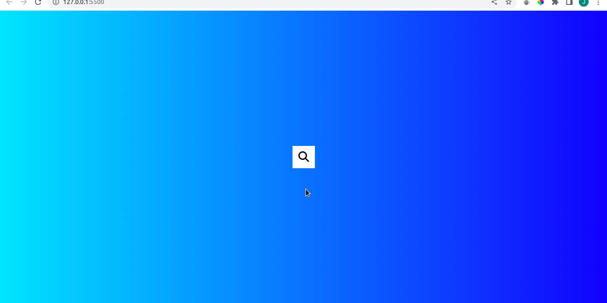

# Hidden Search Widget

Este é um simples projeto de um widget de botão de pesquisa, utilizado em praticamente todos os tipos de aplicações web, com diferentes modos de usar, como por exemplo, fazer uma pesquisa na web ou em outras ocasiões, uma pesquisa dentro da propria aplicação.

 
 

Este projeto foi construído em HTML, CSS e JavaScript

 
 

 
 
Made with :heart: by JADER BORGES, veja meu <a href="https://www.linkedin.com/in/jader-borges-3191a522a/">LinkedIn</a>